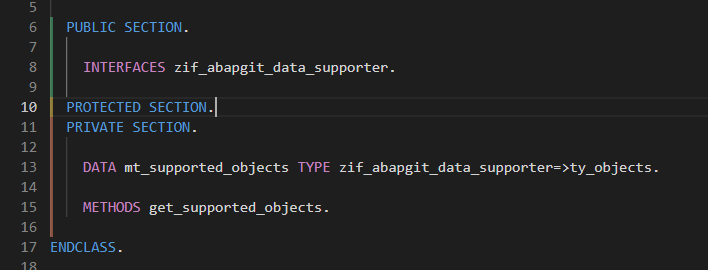

# abap-section-colours README

Colour ABAP class definition sections in the editor.

The extension highlights `PUBLIC SECTION.`, `PROTECTED SECTION.`, and `PRIVATE SECTION.` blocks in ABAP class definitions with subtle left-side colour guides.

